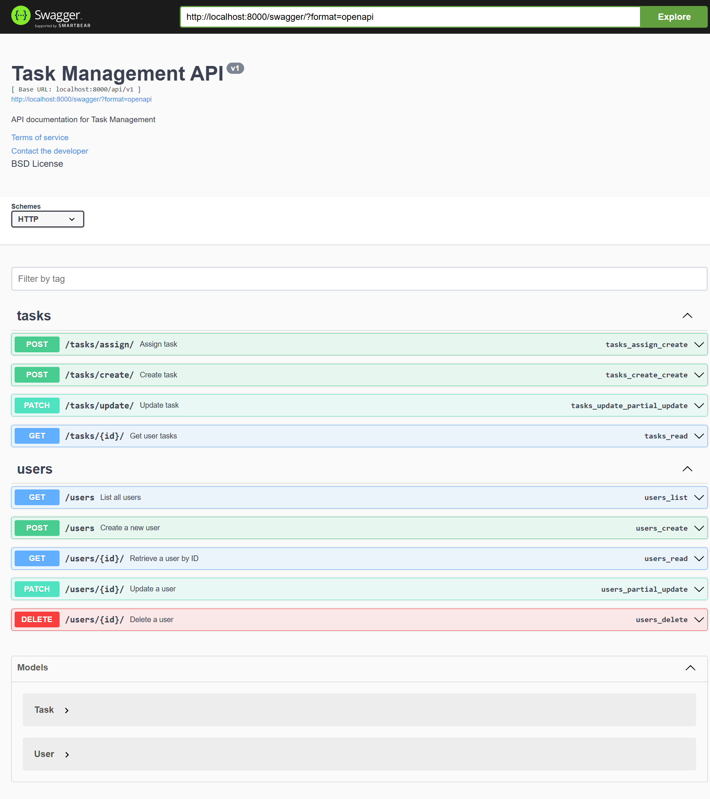

# Django Project Setup and Running Guide

## Prerequisites
Ensure you have the following installed:
- Python (>=3.8)
- Virtualenv (optional but recommended)

## Cloning the Repository
```sh
git clone https://github.com/nayan441/task-management.git
cd task-management
```

## Setting Up the Virtual Environment
```sh
python -m venv venv
source venv/bin/activate  # On Windows use: venv\Scripts\activate
pip install -r requirements.txt
```

## Running the Project
To start the Django development server:
```sh
python manage.py runserver 8000
```

## Database Setup(For new database setup)
Run the following commands to apply migrations and create a superuser:
```sh
python manage.py makemigrations task_management
python manage.py migrate
```
## API Documentetion
Swagger UI document is integrated. You can access it through below url.
```sh
http://127.0.0.1:8000/swagger/
```


## Text and Video documentation

[Click here to view documentetion](assets/setup_documentetion.pdf)

[Click here to watch the video](assets/screen-record-task-management_EO2AsFO1.mkv)


## Contact
For any issues, contact [ynayan93@gmail.com](mailto:ynayan93@gmail.com).

